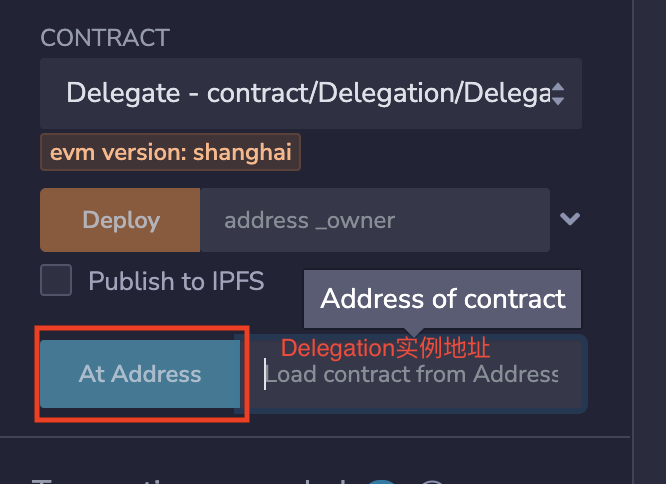
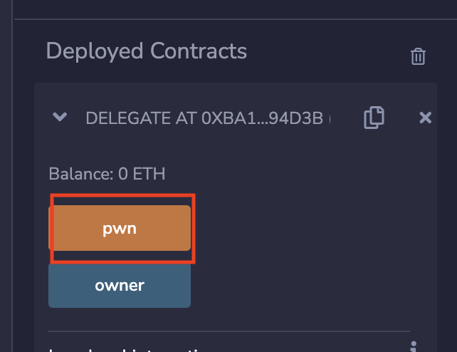

# Ethernaut 06-Delegation

## 本关目标

- 成为合约的 owner

## 合约分析

```solidity
// SPDX-License-Identifier: MIT
pragma solidity ^0.8.0;

contract Delegate {

  address public owner;

  constructor(address _owner) {
    owner = _owner;
  }

  function pwn() public {
    owner = msg.sender;
  }
}

contract Delegation {

  address public owner;
  Delegate delegate;

  constructor(address _delegateAddress) {
    delegate = Delegate(_delegateAddress);
    owner = msg.sender;
  }

  // 当用户调用的函数不在Delegation中时，会调用fallback()
  fallback() external {
    // 使用的是delegatecall，调用msg.data对应函数的逻辑，修改的是Delegation对应slot的变量值
    (bool result,) = address(delegate).delegatecall(msg.data);
    if (result) {
      this;
    }
  }
}
```

## 解决方案

1. 调用不在 Delegation 但是在 Delegate 中的 pwn()，修改 slot0 中的 owner
2. 在 Remix 中使用 At Address 填写 Delegation 实例地址，但是部署 Delegate 合约  
   
3. 调用 pwn()，修改 owner  
   
